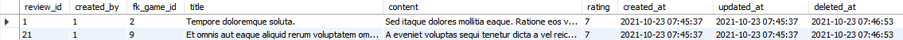

# [Paranoid Models](https://sequelize.org/master/manual/paranoid.html)

Paranoid models are used when you want to "hide" data rather than actually deleting it.

*Note: Paranoid models should not be enabled on join/junction/through tables.*

To demonstrate, we will make some changes to our `Users` model, and also the `Stories` and `Reviews` models as they are related.

In [`Users.js`](../server/src/models/Users.js):

```js
const Users = db.define(
    'Users', // model alias
    {
        // columns are not changed...
    },
    {
        tableName: 'users', // the actual name of the table in the database
        timestamps: true, // enable timestamps for created at and updated at
        createdAt: 'created_at', // name of the created at column
        updatedAt: 'updated_at', // name of the updated at column

        // paranoid tables adds an additional column deleted at 
        // to indicate whether a row of data has been "soft" deleted
        // so when deleting user data, we are now only setting the deleted at column
        // and not actually removing the data from database
        paranoid: true,
        deletedAt: 'deleted_at' // name of the deleted at column
    }
);
```

In [`Stories.js`](../server/src/models/Stories.js):

```js
const Stories = db.define(
    'Stories',
    {
        // columns are not changed...
    },
    {
        tableName: 'stories',
        timestamps: true,
        createdAt: 'created_at',
        updatedAt: 'updated_at',
        paranoid: true,
        deletedAt: 'deleted_at'
    }
);
```

In [`Reviews.js`](../server/src/models/Reviews.js):

```js
const Reviews = db.define(
    'Reviews',
    {
        // columns are not changed...
    },
    {
        tableName: 'stories',
        timestamps: true,
        createdAt: 'created_at',
        updatedAt: 'updated_at',
        paranoid: true,
        deletedAt: 'deleted_at'
    }
);
```

## Deleting

No changes are really necessary, but if you do have relationships connected to the paranoid model, cascade delete will not work anymore.

Thus, in [`users.js`](../server/src/controllers/users.js):

```js
const destroyUser = Users.destroy({
    where: { user_id }, force
});

const destroyStory = Stories.destroy({
    where: { created_by }, force
});

const destroyReviews = Reviews.destroy({
    where: { created_by }, force
});

const destroyed = await Promise.all([destroyUser, destroyStory, destroyReviews]);
```

Now, we can optionally choose to delete a user *forcefully* (whether to actually delete the data or hide it by setting the `deleted_at` column) using the `force` property which accepts true/false.

You can also do the same on a model instance:

```js
await user.destroy({ force });
```

The `force` property defaults to false.

### "Soft" Delete

We can make an API call to "soft" (not really) delete a user:

```
[DELETE] localhost:8080/api/users/1?force=0
```

Results:




We can see that the `deleted_at` column is populated with the time of deletion.

### "Hard" Delete

We can also make an API call to "hard" (really) delete a user:

```
[DELETE] localhost:8080/api/users/1?force=1
```

It will even delete those that were already "soft" deleted.

## Restoring

We can bring back "soft" deleted data using the `restore` method on either the model or a model instance:

```js
// restore on the model
await Users.restore({
    where: { user_id }
});

// get a "soft" deleted user
const user = Users.findOne({
    where: { user_id },
    
    // used to ignore the paranoid feature (delete_at)
    // defaults to true (to hide soft deleted users)
    paranoid: false
});

// restore on the instance
await user.restore();
```

We can call the API to do so:

```
[PUT] localhost:8080/api/restore/users/1
```

Results:


From what we can see, restoring the rows of data does not affect their `updated_at` column.
