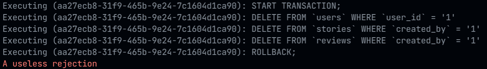

# [Transactions](https://sequelize.org/master/manual/transactions.html)

Transactions give us the power to revert changes in the database.

For example, we currently have user data, but these user data are also linked to our story and review data. While normally we would rely on cascade delete, there are times where it may not work, such as using paranoid models.

To create a new transaction, we need the instance of Sequelize from [`connection.js`](../server/src/config/connection.js):

```js
// create a transaction from the db connection
const transaction = await db.transaction();
```

To use this transaction, we can see [`users.js`](../server/src/controllers/users.js):

```js{4,10-12,14-16,18-20,35,43}
// purposefully cause an error
module.exports.stupidDelete = async (req, res, next) => {
    // create a transaction from the db connection
    const transaction = await db.transaction();
    
    try {
        const { uid } = req.params;
        const force = bool(req.query.force);

        const destroyUser = Users.destroy({
            where: { user_id: uid }, force, transaction
        });

        const destroyStory = Stories.destroy({
            where: { created_by: uid }, force, transaction
        });

        const destroyReviews = Reviews.destroy({
            where: { created_by: uid }, force, transaction
        });

        // this rejection will always cause an error
        const rejection = new Promise((resolve, reject) => {
            setTimeout(() => reject('A useless rejection'), 1000);
        });

        const destroyed = await Promise.all([
            destroyUser,
            destroyStory,
            destroyReviews,
            rejection
        ]);

        // now that all changes are safe, we commit to them
        await transaction.commit();

        res.status(200).send();
        return next();
    }
    catch (error) {
        // an error occured
        // we need to safely revert changes to our data
        await transaction.rollback();
        return next(error);
    }
};
```

Don't forget to commit or rollback your transactions. They will timeout and cause errors otherwise.

Try on this API endpoint:

```
[DELETE] localhost:8080/api/stupid/users/1
```

You can see in the console that Sequelize is logging its SQL commands:


